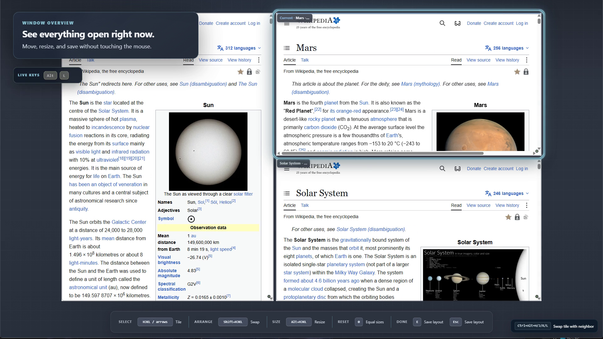
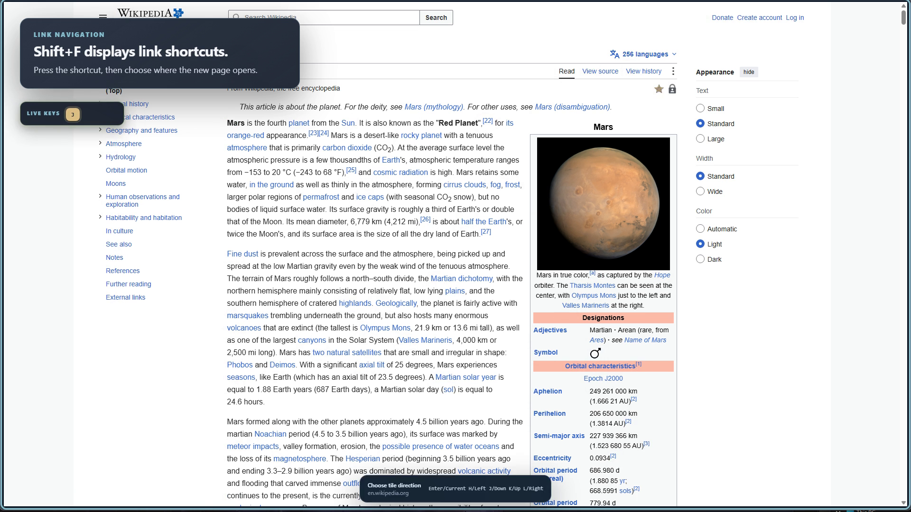
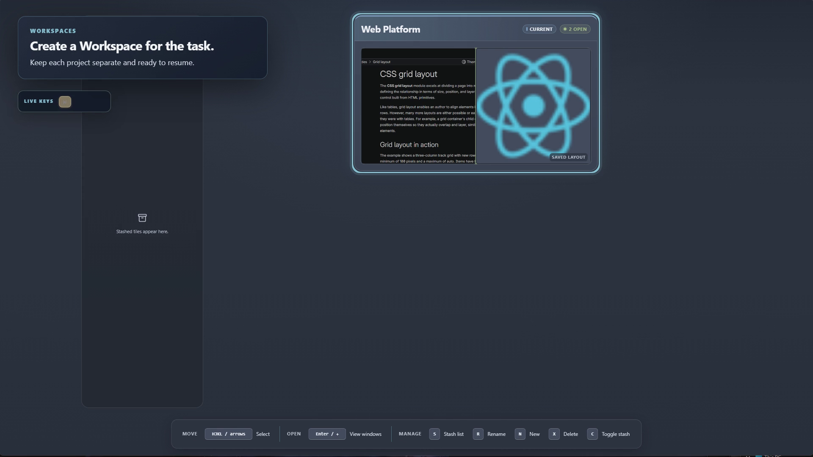
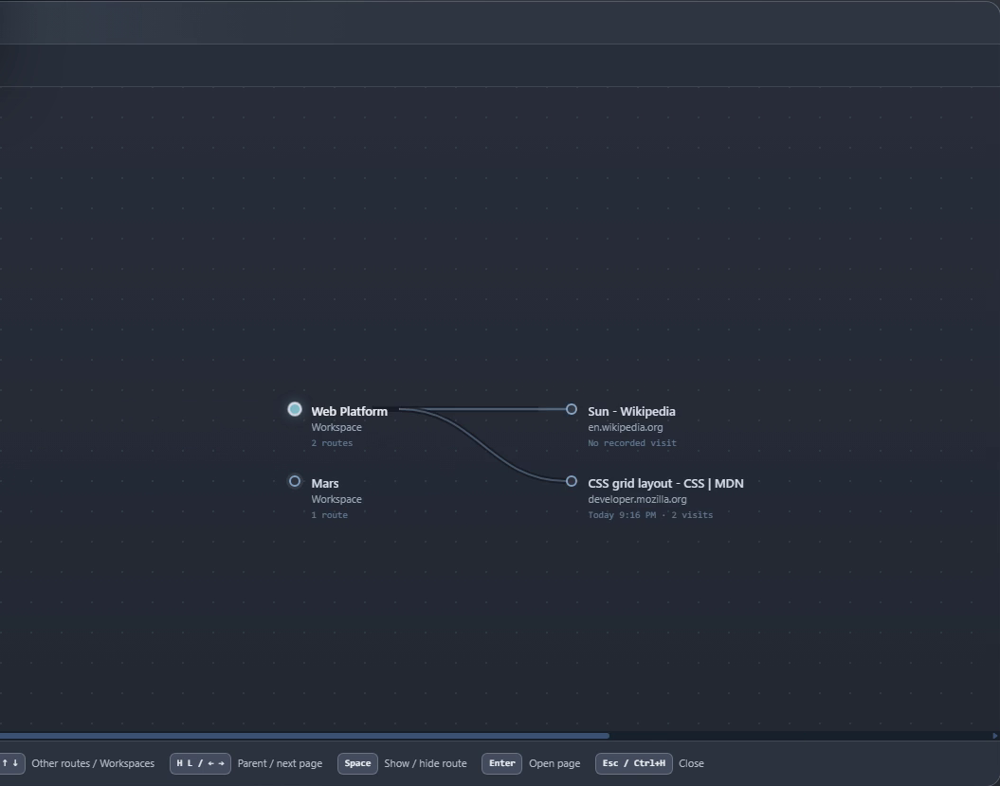

<p align="center">
  
</p>

<h1 align="center">Glub Browser</h1>

<p align="center">
  <strong>A keyboard-first spatial browser for people who think in paths, not tab strips.</strong>
</p>

<p align="center">
  <a href="../../releases"></a>
  
  
  
</p>

<p align="center">
  <a href="#what-makes-glub-different">What makes it different</a>
  ·
  <a href="#getting-started">Getting started</a>
  ·
  <a href="#essential-controls">Controls</a>
  ·
  <a href="../../releases">Releases</a>
</p>

> [!NOTE]
> Glub Browser is in early development. Windows x64 is the first supported platform.
> Official installers and update files will appear only on this repository's
> [Releases page](../../releases).

## Browsing should feel spatial

Glub is a web browser built around a simple idea: opening a page should not mean losing
the page that led you there.

Instead of compressing everything into a strip of tabs, Glub lets pages branch into
directional tiles. Zoom out to see the windows you have open, zoom out again to move
between Workspaces, then return to browsing without rebuilding your context.

<p align="center">
  
</p>

## What makes Glub different

| | |
|---|---|
| **Spatial windows** | Open a linked page left, right, above, or below the page you are reading. Your source stays where you left it. |
| **Workspaces** | Keep separate research, projects, and everyday browsing contexts ready to resume. |
| **Stash** | Set a page aside without closing it or forcing it into the current layout. Grab or clone it into another Workspace later. |
| **Journey history** | History is presented as a calm transit map of the routes you followed, not a flat list of URLs. |
| **Keyboard-native** | Every core action is designed around predictable keys, visible hints, and directional navigation. |
| **Quiet browsing** | Management controls stay out of the way while you read. Window Overview and Open Page Control reveal them when needed. |

<p align="center">
  
  
</p>

## Getting started

### 1. Browse normally

Start typing on the opening search page, or press <kbd>Ctrl</kbd> + <kbd>L</kbd> from
anywhere to enter a URL or search.

Press <kbd>i</kbd> when a page input needs normal typing. Press <kbd>Esc</kbd> to return
the keyboard to Glub.

### 2. Follow a link without losing your place

Press <kbd>F</kbd> to label links on the current page, then type a label.

- Press <kbd>Enter</kbd> to continue in the current tile.
- Press <kbd>H</kbd>, <kbd>J</kbd>, <kbd>K</kbd>, or <kbd>L</kbd> to open the page
  left, below, above, or right.
- Press lowercase <kbd>f</kbd> when you want action controls such as buttons and fields.

The new page slides out from the current one, so the relationship remains visually clear.

### 3. Zoom through your browsing space

Press <kbd>W</kbd> repeatedly:

```text
Browsing  →  Window Overview  →  Workspaces  →  Browsing
```

Window Overview is where you select, move, resize, stash, or close visible tiles.
Workspaces is where you move between larger browsing contexts.

### 4. Find and manage any open page

Press <kbd>T</kbd> for **Open Page Control**. It groups open and stashed pages by
Workspace and offers only the actions that make sense for the selected page: jump,
grab, clone, stash, or close.

Press <kbd>F</kbd> inside the panel to search.

### 5. Revisit the route you took

Press <kbd>Ctrl</kbd> + <kbd>H</kbd> for History. Navigate its transit-style routes
with <kbd>H</kbd>/<kbd>J</kbd>/<kbd>K</kbd>/<kbd>L</kbd> or the arrow keys, expand a
route with <kbd>Space</kbd>, and reopen a page with <kbd>Enter</kbd>.

<p align="center">
  
</p>

## Essential controls

| Keys | Action |
|---|---|
| <kbd>Ctrl</kbd> + <kbd>?</kbd> | Show controls for the current view |
| <kbd>Ctrl</kbd> + <kbd>L</kbd> | Search or enter a URL |
| <kbd>i</kbd> / <kbd>Esc</kbd> | Give typing to the page / return to Glub |
| <kbd>h</kbd> / <kbd>l</kbd> | Back / forward |
| <kbd>j</kbd> / <kbd>k</kbd> | Scroll down / up |
| <kbd>f</kbd> / <kbd>F</kbd> | Label page actions / links |
| <kbd>t</kbd>, then <kbd>H/J/K/L</kbd> | Create a directional search tile |
| <kbd>W</kbd> | Cycle Browsing, Window Overview, and Workspaces |
| <kbd>T</kbd> | Open or close Open Page Control |
| <kbd>Ctrl</kbd> + <kbd>H</kbd> | Open journey history |
| <kbd>Ctrl</kbd> + <kbd>J</kbd> | Open Downloads |
| <kbd>Ctrl</kbd> + <kbd>Shift</kbd> + <kbd>N</kbd> | Enter or leave private mode |

Glub's bottom command bar changes with the current view, so you do not need to memorize
the whole browser at once.

## Built-in browser essentials

Glub already includes the less-visible work expected from a modern browser:

- downloads with pause, resume, cancel, open, and show-in-folder actions;
- encrypted local credential storage backed by the operating system;
- per-site permissions and site-data controls;
- network and cosmetic ad/tracker protection with per-site exceptions;
- private Workspaces that are discarded when private mode ends; and
- keyboard-searchable open pages, downloads, passwords, and history.

Normal Workspaces currently share the same website identity and cookies. They organize
browsing context; they are not separate security profiles.

## Releases and safety

The Glub Browser source is maintained in a separate private repository. This public
repository is the official home for:

- Windows installers;
- update metadata and checksums; and
- public release notes.

Do not download files presented as Glub Browser builds from unofficial mirrors.
Early preview installers may trigger Windows SmartScreen until production code signing
is in place.

macOS and Linux support are planned after the Windows release and updater path is stable.

---

<p align="center">
  <strong>Glub Browser</strong><br>
  Fast browsing. Organized research. All keyboard.
</p>
