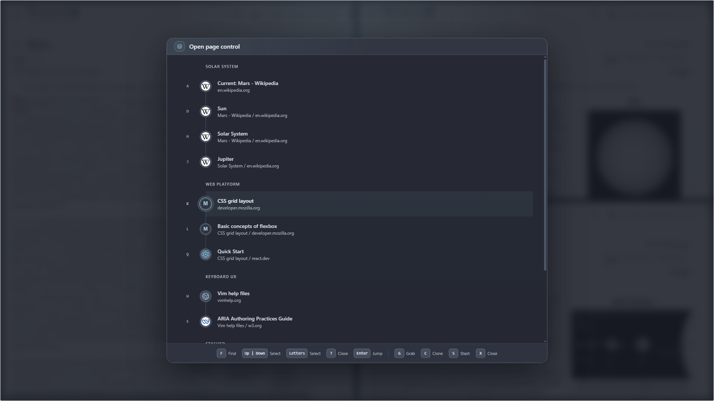
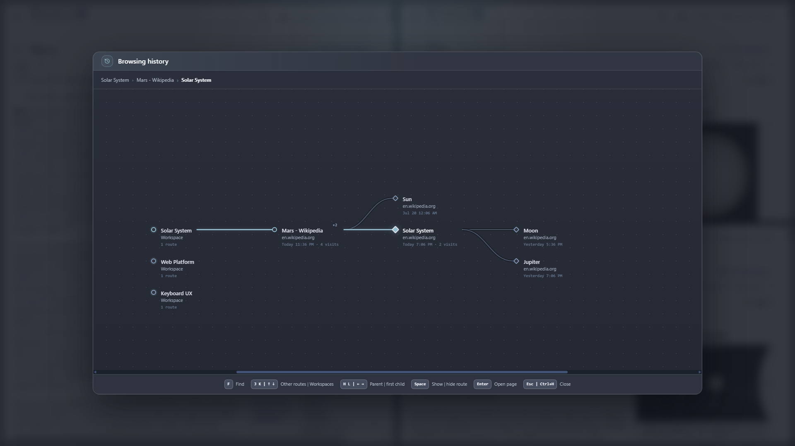

<p align="center">
  
</p>

<h1 align="center">Glub Browser</h1>

<p align="center">
  <strong>A keyboard-first Windows browser that replaces the tab strip with spatial page tiles, zoomable Workspaces, and a transit-style history map.</strong>
</p>

<p align="center">
  <a href="https://github.com/Glub-Corporation/glub-browser-releases/releases"></a>
  
  
  
</p>

<p align="center">
  <a href="#why-glub">Why Glub</a>
  &middot;
  <a href="#install-the-windows-preview">Install</a>
  &middot;
  <a href="#learn-glub-in-five-minutes">First five minutes</a>
  &middot;
  <a href="#command-reference">Controls</a>
  &middot;
  <a href="#privacy-and-data">Privacy</a>
</p>

> [!NOTE]
> Glub Browser is an early Windows x64 preview. The installer is not yet code-signed,
> so Windows SmartScreen may show a warning. Download Glub only from this repository's
> [Releases page](https://github.com/Glub-Corporation/glub-browser-releases/releases).

## What Glub does

Glub is a Chromium-based web browser built around page relationships instead of a tab
strip. Following a link can open a new page to the left, right, above, or below the
page that led to it. The source remains visible, the new page has a clear place, and
the layout becomes a map of the work you are doing.

You can still enter URLs, search the web, sign in to sites, download files, save
passwords, use private browsing, manage permissions, and block ads and trackers. Glub
changes how those pages are organized and controlled.

### The model in one minute

| Part | What it means |
|---|---|
| **Page tile** | A live webpage in the current layout. Several tiles can remain open and visible at once. |
| **Window Overview** | A zoomed-out view of the current Workspace. Use it to focus, move, resize, stash, close, or inspect a tile. |
| **Workspace** | A saved browsing context for a project, topic, or routine, including its page layout. |
| **Stash** | A shared holding area for open pages set aside without being closed. Stashed pages remain available but do not occupy a visible layout. |
| **Open Page Control** | The operational list of pages that are open or stashed, grouped by Workspace. It is not browsing history. |
| **History map** | A transit-style record of pages you visited and the routes between them, including pages that are no longer open. |

## Why Glub

A tab strip records that pages are open, but not why they are open or where they came
from. Research turns into a row of compressed titles, and returning later means
reconstructing the context yourself.

Glub keeps that context in the interface:

- a branch stays beside the page that produced it;
- directional placement gives related pages a predictable location;
- Workspaces preserve larger browsing contexts;
- Stash separates "keep this" from "show this now"; and
- the History map records the route, not just a flat list of URLs.

The keyboard follows the same spatial logic. <kbd>h</kbd>, <kbd>j</kbd>,
<kbd>k</kbd>, and <kbd>l</kbd> mean left, down, up, and right wherever a direction
is needed. The command bar and <kbd>Ctrl</kbd> + <kbd>?</kbd> show only the commands
that apply to the view you are using.

<p align="center">
  
</p>

## Install the Windows preview

Glub currently supports 64-bit Windows 10 and Windows 11.

1. Open the [Releases page](https://github.com/Glub-Corporation/glub-browser-releases/releases)
   and choose the newest preview.
2. Download `Glub-Browser-Setup-<version>-x64.exe` and `SHA256SUMS.txt`.
3. In PowerShell, run the command below from your Downloads folder and compare its
   `Hash` with the installer entry in `SHA256SUMS.txt`.
4. Run the installer, choose an install location, and launch **Glub Browser** from
   the Start menu or desktop shortcut.

```powershell
Get-FileHash .\Glub-Browser-Setup-<version>-x64.exe -Algorithm SHA256
```

The preview installer is not yet code-signed, so Windows identifies its publisher as
unknown and SmartScreen may show **Windows protected your PC**. Confirm that the file
came from `Glub-Corporation/glub-browser-releases` and that its hash matches before
choosing **More info** and **Run anyway**. If either check fails, do not run it.

Packaged builds check this repository for preview updates about 15 seconds after
launch and every four hours while running. An available update downloads in the
background and installs after you close Glub; browsing is never interrupted by a
forced restart.

## Learn Glub in five minutes

### 1. Search or open a website

Start typing on Glub's opening search page, or press <kbd>Ctrl</kbd> +
<kbd>L</kbd> while browsing or using a spatial overview to enter a URL or search.

When you select a text field on a webpage, Glub automatically gives normal typing to
that field. Press <kbd>Esc</kbd> to return the keyboard to browser commands.

### 2. Browse with the home-row keys

While a webpage owns no text input:

- <kbd>j</kbd> &vert; <kbd>k</kbd> scroll down or up;
- <kbd>h</kbd> &vert; <kbd>l</kbd> go back or forward;
- <kbd>r</kbd> reloads;
- <kbd>gg</kbd> &vert; <kbd>Shift</kbd> + <kbd>g</kbd> go to the top or bottom; and
- <kbd>/</kbd>, then a phrase, finds text on the page.

### 3. Open a link beside its source

Press <kbd>Shift</kbd> + <kbd>f</kbd> to label links, then type the displayed label.

- <kbd>Enter</kbd> opens the link in the current tile.
- <kbd>h</kbd> opens it to the left.
- <kbd>j</kbd> opens it below.
- <kbd>k</kbd> opens it above.
- <kbd>l</kbd> opens it to the right.

Press <kbd>f</kbd> without Shift when you want to label page actions such as buttons
and text fields. Choosing a text field enters page input automatically.

<p align="center">
  
</p>

### 4. Create a fresh search tile

Press <kbd>t</kbd>, then choose <kbd>h</kbd>, <kbd>j</kbd>, <kbd>k</kbd>, or
<kbd>l</kbd>. Glub creates a new search page in that direction.
Press <kbd>Enter</kbd> instead to turn the current tile into a fresh search page.

### 5. Zoom out instead of hunting through tabs

Press <kbd>Shift</kbd> + <kbd>w</kbd> repeatedly:

```text
Browsing → Window Overview → Workspaces → Browsing
```

- **Window Overview** manages the tiles in the current Workspace.
- **Workspaces** switches between saved browsing contexts and the shared Stash.
- <kbd>Enter</kbd> returns to the selected page.

<p align="center">
  
</p>

### 6. Find any page that is still open

Press <kbd>Shift</kbd> + <kbd>t</kbd> for **Open Page Control**.

1. Press <kbd>f</kbd> to search, or use <kbd>Up</kbd> &vert; <kbd>Down</kbd>.
2. A displayed letter selects that page; it does not activate it immediately.
3. Press <kbd>Enter</kbd> to jump to a page in its Workspace.
4. For a page elsewhere, press <kbd>g</kbd> to **Grab** it into the current
   Workspace or <kbd>c</kbd> to **Clone** it while leaving the original in place.
5. Press <kbd>s</kbd> to stash or <kbd>x</kbd> to close when that action is available.

The footer changes with the selected page, so actions that do not make sense are not
shown. Press <kbd>Shift</kbd> + <kbd>t</kbd> or <kbd>Esc</kbd> to close the panel.
Press <kbd>Ctrl</kbd> + <kbd>K</kbd> when you want to open the same panel with Find
already active.

<p align="center">
  
</p>

### 7. Revisit where you have been

Press <kbd>Ctrl</kbd> + <kbd>H</kbd> for the **History map**.

- <kbd>h</kbd> &vert; <kbd>l</kbd> move to the parent or first child.
- <kbd>j</kbd> &vert; <kbd>k</kbd> move between nearby routes or Workspaces.
- <kbd>Space</kbd> shows or hides the selected route.
- <kbd>f</kbd> searches pages, sites, and Workspaces.
- <kbd>Enter</kbd> reopens the selected page.

The selected station stays centered while the relevant route expands around it.

<p align="center">
  
</p>

## Common workflows

### Compare pages without losing the original

Press <kbd>Shift</kbd> + <kbd>f</kbd>, choose a link, then press <kbd>l</kbd> to
open it on the right. Use <kbd>Alt+H</kbd> &vert; <kbd>Alt+L</kbd> to move focus
between the two tiles.
Repeat from either tile to keep branching.

### Clear the layout without losing a useful page

Press <kbd>Shift</kbd> + <kbd>w</kbd> for Window Overview, select the page with
<kbd>h</kbd> &vert; <kbd>j</kbd> &vert; <kbd>k</kbd> &vert; <kbd>l</kbd>, and press
<kbd>s</kbd>. The page moves to Stash and the overview remains open. Retrieve it later
from Workspaces or Open Page Control.

### Move work between Workspaces

Open Window Overview, select a tile, and press <kbd>m</kbd> to move it. From Open
Page Control, <kbd>g</kbd> moves a page into the current Workspace and <kbd>c</kbd>
copies it here.

### Manage a site's permissions and protection

Press <kbd>Shift</kbd> + <kbd>w</kbd>, select the site's tile, then press
<kbd>i</kbd>. Site Controls contains connection information,
camera/microphone/location/notification choices, site data, saved accounts for that
origin, and the site's protection exception. Use <kbd>Tab</kbd> and
<kbd>Shift</kbd> + <kbd>Tab</kbd> inside the panel. These controls stay hidden
during normal browsing. The **Saved logins** section opens the password manager for
searching or removing accounts.

### Find a downloaded file

Press <kbd>Shift</kbd> + <kbd>d</kbd> for Downloads. Press <kbd>f</kbd> to search
by filename or website, move with <kbd>j</kbd> &vert; <kbd>k</kbd>, and use
<kbd>Tab</kbd> to reach the available pause, resume, cancel, open, show-in-folder, or
return-to-page action.

## Command reference

Keys are case-sensitive. Glub writes shifted commands literally below:
<kbd>Shift</kbd> + <kbd>f</kbd>, for example, is different from <kbd>f</kbd>.

### Core browser shortcuts

Use these while browsing or in the spatial overview views. When a modal is open, its
footer shows the commands that remain available there.

| Keys | Action |
|---|---|
| <kbd>Ctrl</kbd> + <kbd>?</kbd> | Show the command groups for the current view |
| <kbd>Ctrl</kbd> + <kbd>L</kbd> | Search or enter a URL |
| <kbd>Ctrl</kbd> + <kbd>K</kbd> | Open Page Control with Find active |
| <kbd>Ctrl</kbd> + <kbd>H</kbd> | Open or close History |
| <kbd>Ctrl</kbd> + <kbd>,</kbd> | Open privacy settings |
| <kbd>Ctrl</kbd> + <kbd>Shift</kbd> + <kbd>L</kbd> | Fill or cycle a saved login for the current site |
| <kbd>Ctrl</kbd> + <kbd>Shift</kbd> + <kbd>N</kbd> | Enter or leave private mode |
| <kbd>Ctrl</kbd> + <kbd>Z</kbd> | Undo the most recent page deletion |
| <kbd>Esc</kbd> | Close the current surface or return from page input |

### Browsing

| Keys | Action |
|---|---|
| <kbd>h</kbd> &vert; <kbd>l</kbd> &vert; <kbd>r</kbd> | Back, forward, or reload |
| <kbd>j</kbd> &vert; <kbd>k</kbd> | Smooth scroll down or up |
| <kbd>d</kbd> &vert; <kbd>u</kbd> | Scroll half a page down or up |
| <kbd>Space</kbd> &vert; <kbd>Shift</kbd> + <kbd>Space</kbd> | Scroll a page down or up |
| <kbd>gg</kbd> &vert; <kbd>Shift</kbd> + <kbd>g</kbd> | Top or bottom |
| <kbd>/</kbd>, <kbd>n</kbd>, <kbd>Shift</kbd> + <kbd>n</kbd> | Find, next result, or previous result |
| <kbd>f</kbd> &vert; <kbd>Shift</kbd> + <kbd>f</kbd> | Label page actions or links |
| <kbd>t</kbd>, then <kbd>h</kbd> &vert; <kbd>j</kbd> &vert; <kbd>k</kbd> &vert; <kbd>l</kbd> | Create a fresh directional search tile |
| <kbd>Alt+HJKL</kbd> | Focus a neighboring tile |
| <kbd>Alt</kbd> + <kbd>w</kbd> | Close the active tile |
| <kbd>Alt+Shift+HJKL</kbd> | Resize the active tile |
| <kbd>Ctrl+Alt+HJKL</kbd> | Swap the active tile with a neighbor |
| <kbd>Alt</kbd> + <kbd>Enter</kbd> | Toggle tile fullscreen |
| <kbd>+</kbd> &vert; <kbd>-</kbd> &vert; <kbd>=</kbd> | Page zoom in, out, or reset |
| <kbd>Shift</kbd> + <kbd>w</kbd> &vert; <kbd>Shift</kbd> + <kbd>t</kbd> &vert; <kbd>Shift</kbd> + <kbd>d</kbd> | Window Overview, Open Page Control, or Downloads |

### Window Overview

| Keys | Action |
|---|---|
| <kbd>h</kbd> &vert; <kbd>j</kbd> &vert; <kbd>k</kbd> &vert; <kbd>l</kbd> or arrow keys | Select a visible tile |
| <kbd>Enter</kbd> | Focus the selected tile |
| <kbd>/</kbd> | Search visible tiles |
| <kbd>m</kbd> &vert; <kbd>s</kbd> | Move to a Workspace or stash |
| <kbd>x</kbd> or <kbd>Delete</kbd> | Close the selected tile |
| <kbd>i</kbd> | Open Site Controls |
| <kbd>p</kbd> | Mark or unmark a landmark |
| <kbd>e</kbd> | Enter or finish layout editing |
| <kbd>Shift+HJKL</kbd> | Swap a tile while editing |
| <kbd>Alt+HJKL</kbd> | Resize a tile while editing |
| <kbd>0</kbd> | Reset tile sizes |
| <kbd>Shift</kbd> + <kbd>w</kbd> | Continue to Workspaces |

### Workspaces

| Keys | Action |
|---|---|
| <kbd>h</kbd> &vert; <kbd>j</kbd> &vert; <kbd>k</kbd> &vert; <kbd>l</kbd> or arrow keys | Move the selection |
| <kbd>Enter</kbd> | Open the selection |
| <kbd>/</kbd> | Search Workspaces |
| <kbd>n</kbd> &vert; <kbd>a</kbd> | Create a Workspace |
| <kbd>r</kbd> | Rename the selected Workspace |
| <kbd>s</kbd> &vert; <kbd>c</kbd> | Focus or collapse Stash |
| <kbd>p</kbd> | Mark or unmark a landmark |
| <kbd>x</kbd> or <kbd>Delete</kbd> | Delete the selected Workspace or close the selected stashed page |
| <kbd>Shift</kbd> + <kbd>w</kbd> | Return toward browsing |

### Open Page Control

| Keys | Action |
|---|---|
| <kbd>f</kbd> | Search open and stashed pages |
| <kbd>Up</kbd> &vert; <kbd>Down</kbd> | Move the selection |
| Shown letter | Select that page |
| <kbd>Enter</kbd> | Jump to the page when available |
| <kbd>g</kbd> &vert; <kbd>c</kbd> | Grab or clone into the current Workspace when available |
| <kbd>s</kbd> &vert; <kbd>x</kbd> | Stash or close when available |
| <kbd>Shift</kbd> + <kbd>t</kbd> or <kbd>Esc</kbd> | Close Open Page Control |

### History and Downloads

| View | Keys |
|---|---|
| **History** | <kbd>f</kbd> find, <kbd>h</kbd> &vert; <kbd>l</kbd> parent or first child, <kbd>j</kbd> &vert; <kbd>k</kbd> nearby route, <kbd>Space</kbd> show or hide route, <kbd>Enter</kbd> open |
| **Downloads** | <kbd>f</kbd> find, <kbd>j</kbd> &vert; <kbd>k</kbd> move, <kbd>Tab</kbd> reach actions, <kbd>Shift</kbd> + <kbd>d</kbd> or <kbd>Esc</kbd> close |

The in-app command bar is the fastest reference: it updates as the current view and
selected item change.

## Browser essentials

Glub currently includes:

- a live Download Tray plus a searchable Download Center;
- local password saving, origin-matched autofill, and strong-password generation;
- per-site permissions, connection details, site-data clearing, and protection exceptions;
- local network and cosmetic ad/tracker blocking with a pinned filtering engine;
- a private browsing mode with a temporary Workspace and in-memory website session;
- persistent Workspaces, layouts, stashes, landmarks, and history; and
- automatic preview updates for installed builds.

## Privacy and data

- **Normal Workspaces organize context, not identity.** They currently share the same
  Chromium cookies, cache, and website login session. Do not use separate Workspaces as
  separate security profiles.
- **Private mode is temporary.** Leaving private mode discards its Workspace, website
  session, permission exceptions, and download records. Files already downloaded remain
  in the Windows Downloads folder.
- **Passwords stay local.** The credential vault is encrypted with Windows secure
  storage and matches credentials to their exact HTTPS origin. Password reveal, export,
  and sync are intentionally unavailable in the preview.
- **Sensitive permissions default to denied.** Camera, microphone, location,
  notifications, and clipboard-read access require an explicit per-site choice.
- **Protection is local and configurable.** Network requests and cosmetic rules are
  filtered locally. Protection can be disabled for a selected site through Site
  Controls; Glub does not claim that blocking is undetectable.

Use <kbd>Ctrl</kbd> + <kbd>,</kbd> to clear cookies and site storage, cached files,
or HTTP authentication without deleting your saved Workspaces.

## Preview status and releases

This public repository is the official binary distribution home for Glub Browser. The
application source is maintained in a separate private repository.

Current preview boundaries:

- Windows 10/11 x64 only;
- unsigned installer while production code signing is being arranged;
- silent background updates with no in-app update status yet;
- no password reveal, password export, or cross-device sync; and
- no isolated website profile per normal Workspace yet.

macOS and Linux support are planned after the Windows installer and updater path is
stable. Release notes are published with each
[release](https://github.com/Glub-Corporation/glub-browser-releases/releases).

---

<p align="center">
  <strong>Glub Browser</strong><br>
  Keep the page. Keep the path.
</p>
